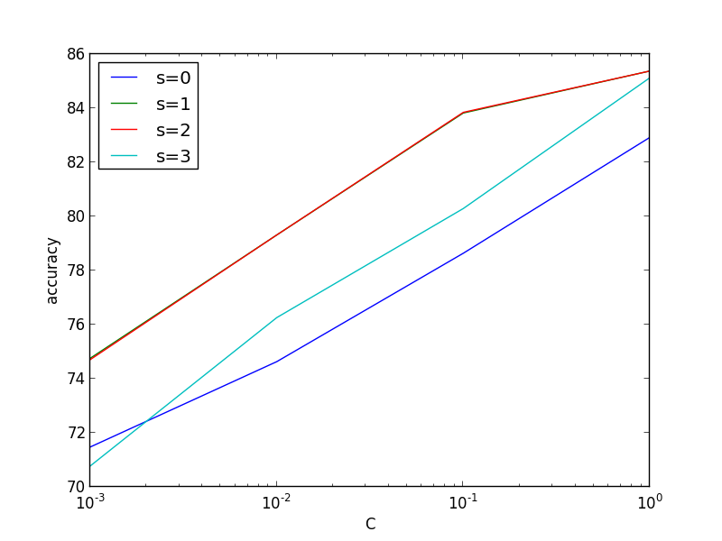
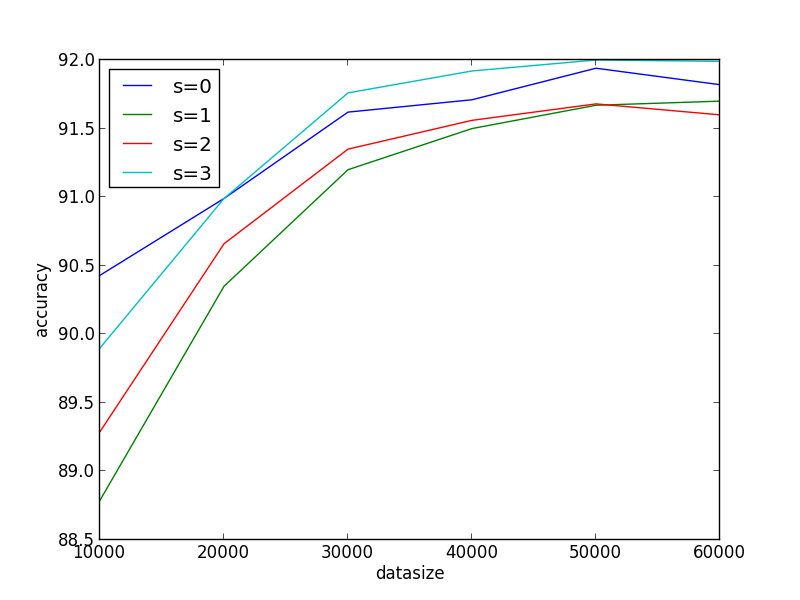

クイックスタート
=================

maf は機械学習の実験管理などをやりやすくするためのツールです。ここでは maf の基本的な使い方を具体例を通して紹介します。

インストール
------------

maf では実験を一つのディレクトリの中で行うことを想定しています。
まずはどこかのディレクトリに移動しましょう。

.. code-block:: sh

   $ mkdir experiment && cd experiment

mafを動かすためには、 ``waf`` および ``maf.py`` という二つのpythonスクリプトが必要です。
これらは実験を行う各ディレクトリ毎に配置するのが良いでしょう。
以下のコマンドでダウンロードできます。

.. code-block:: sh

   $ wget https://github.com/pfi/maf/raw/master/waf && wget https://github.com/pfi/maf/raw/master/maf.py && chmod +x waf

mafでは実験の手順を ``wscript`` というファイルに記述していきます。
以下は実験ではないですが、 ``wscript`` の書き方の簡単な例です。

.. code-block:: sh

   $ cat wscript
   import maf
   
   def configure(conf): pass
   
   def build(exp):
       exp(target='output',
           rule='echo hoge > ${TGT}')
   
   $ ./waf configure           # wscriptに書いたconfigureが実行される。実験を始める前に必要。
   Setting top to                           : /.../experiment 
   Setting out to                           : /.../experiment/build 
   'configure' finished successfully (0.004s)
   $ ./waf build               # wscriptに書いたbuildの手順が実行される。
   Waf: Entering directory `/.../experiment/build'
   [1/1] output:  -> build/output
   Waf: Leaving directory `/.../experiment/build'
   'build' finished successfully (0.016s)
   $ cat build/output
   hoge

``wscript`` 自体もpythonのスクリプトとなっていて、これが ``waf`` を実行することで読み込まれます。
最初のコマンド ``configure`` はとりあえず気にする必要はありませんが、実験を行う前に実行する必要があります。
次の ``build`` がメインの実行で、 ``wscript`` に書いた ``build`` 関数を実行します。
この例では、ここに書いた ``rule`` 内の ``${TGT}`` が自動で置き換えられた、以下のコマンドが実行されます。

.. code-block:: sh

   $ echo hoge > build/output

この ``${TGT}`` の対応が、 ``target`` 変数で指定されています。
mafでは実験途中のモデルや結果を繋げて処理を行っていきますが、このように結果は全て ``build`` ディレクトリ以下に作られます。

``./waf build`` がメインのコマンドですが、これは頻繁に使うので、 ``build`` を省略しても良いことになっています。

.. code-block:: sh

   $ ./waf     # ./waf build の省略形

以下の例では、このように ``build`` を省略します。

実際の実験例
------------

もう少し具体的な例を通して、mafでの実験手順を紹介します。
mafが特に役に立つのは、様々なパラメータや手法に関する試行錯誤を行わないといけない場面です。
簡単な例として、ここでは `LIBLINEAR <http://www.csie.ntu.edu.tw/~cjlin/liblinear/>`_ を使用し、このパラメータのチューニングを行う場面を考えます。
mafを使えば、Figure :num:`c-vs-accuracy` のような特定のパラメータを変化させた場合の性能の変化や、Figure :num:`size-vs-accuracy` のような訓練データ量に対する性能の変化といった結果を、20行程度の ``wscript`` を書くことで得ることができます。
またmafでは試行錯誤をやりやすくするために、パラメータの設定の変更などが容易に行えます。
例えばFigure :num:`c-vs-accuracy` ではパラメータ ``C`` の値を ``10^-3`` から ``1`` まで変化させていますが、もっと大きくした ``C=10`` の値まで含めたいと思った場合、そのように ``wscript`` を書き換えれば ``C=10`` での実験のみが追加で行われ、新しいグラフを得ることができます。
つまり既に実行済みのパラメータ設定を自動的に検出し、図を描くのに足りない設定のみを追加で実行してくれます。

.. _c_vs_accuracy:

   手法毎の、パラメータCを変化させたときの性能変化

.. _size_vs_accuracy:

   訓練データを増やしたときの学習曲線

データとツールの準備
~~~~~~~~~~~~~~~~~~~~

ここでは実験用のツールとして `LIBLINEAR <http://www.csie.ntu.edu.tw/~cjlin/liblinear/>`_ を、データとして `20 News <http://www.csie.ntu.edu.tw/~cjlin/libsvmtools/datasets/multiclass.html#news20>`_ という文書分類タスク用のデータを用います。
LIBLINEARは各データが特徴ベクトルに変換された入力を必要としますが、MNIST をこの形式に変換したデータが手に入るのでこれを使いましょう。

.. code-block:: sh

   $ wget http://www.csie.ntu.edu.tw/~cjlin/libsvmtools/datasets/multiclass/news20.scale.bz2
   $ wget http://www.csie.ntu.edu.tw/~cjlin/libsvmtools/datasets/multiclass/news20.t.scale.bz2
   $ bunzip2 *.bz2
   $ ls
   maf.py  news20.scale  news20.t.scale  waf   wscript

``news20.scale`` が訓練データ、 ``news20.t.scale`` がテストデータです。

LIBLINEARがマシンにインストールされていない場合は事前にインストールが必要です。
以下は各種パッケージ管理でのインストール例です。

.. code-block:: sh

   $ sudo apt-get install liblinear1 liblinear-tools  # apt
   $ sudo yum install liblinear liblinear-devel  # yum
   $ brew install liblinear  # homebrew

これで実験の準備が整いました。
   
図を描くためのwscript
~~~~~~~~~~~~~~~~~~~~~

wscript を以下のように書き換えて実行 ( ``./waf`` ) すると、Figure :num:`c-vs-accuracy` を得ることができます。
結果は ``build/accuracy.png`` に得られます。

.. code-block:: python

   import maf
   import maflib.util
   import maflib.plot

   def configure(conf): pass

   def build(exp):
       exp(source='news20.scale',                # exp(...) を複数定義すると、それらが順に実行される
           target='model',
           parameters=maflib.util.product({
               's': [0, 1, 2, 3],
               'C': [0.001, 0.01, 0.1, 1]}),
           rule='liblinear-train -s ${s} -c ${C} ${SRC} ${TGT} > /dev/null')
    
       exp(source='news20.t.scale model',
           target='accuracy',
           rule='liblinear-predict ${SRC} /dev/null > ${TGT}')

       exp(source='accuracy',
           target='accuracy.json',
           rule=maflib.rules.convert_libsvm_accuracy)

       exp(source='accuracy.json',
           target='accuracy.png',                # 最終的な結果が、 build/accuracy.png に得られる
           for_each='',
           rule=maflib.plot.plot_line(
               x = {'key': 'C', 'scale': 'log'},
               y = 'accuracy',
               legend = {'key': 's'}))

この例では、 ``build(exp)`` の中に計4個の ``exp(...)`` が存在します。
実験は、訓練データからのモデルの学習、それを使ってのテストデータの予測など複数の手順からなりますが、この際の各手順を ``exp(...)`` の中に定義しています。
具体的には、このwscriptでは以下のような手順で実験が進みます。

1. 様々なパラメータの設定で ``liblinear-train`` を実行し、訓練後のモデルファイルの集合を得る。
2. 得られた各モデルファイルを用いて ``liblinear-predict`` を実行し、モデル毎のテストデータに対する精度を計算する。
3. 得られた各精度の数値をjson形式に変換する。次のグラフ描画のために必要。
4. これまで得られた各モデル毎の精度をもとに、グラフを描画する。

パラメータの管理
~~~~~~~~~~~~~~~~~

Figure :num:`c-vs-accuracy` では、横軸で ``C`` を変化させ、各 ``s`` の値毎に精度をプロットしています。
この  ``C`` と ``s`` はどちらもLIBLINEARのパラメータです。

.. code-block:: none

   $ liblinear-train
   Usage: train [options] training_set_file [model_file]
   options:
   -s type : set type of solver (default 1)
     for multi-class classification
            0 -- L2-regularized logistic regression (primal)
            1 -- L2-regularized L2-loss support vector classification (dual)
            2 -- L2-regularized L2-loss support vector classification (primal)
            3 -- L2-regularized L1-loss support vector classification (dual)
            4 -- support vector classification by Crammer and Singer
            ...
   -c cost : set the parameter C (default 1)
   ...

このような図を描くためには、各 ``s`` の値毎に、 ``C`` の値を変えて訓練及びテストを行った結果を保持しないといけません。
mafではこのようなパラメータの組み合わせを保持することが簡単にできます。
最初の ``exp`` 呼び出しは以下のようになっています。

.. code-block:: python

   exp(source='news20.scale',
       target='model',
       parameters=maflib.util.product({
           's': [0, 1, 2, 3],
           'C': [0.001, 0.01, 0.1, 1]}),
       rule='liblinear-train -s ${s} -c ${C} ${SRC} ${TGT} > /dev/null')

一番最初の例と違うのは、 ``parameters`` という変数が指定されている点です。
ここで用いている :py:func:`maflib.util.product` は、このように複数のリストを与えると、それらの直積を計算してくれる関数です。
そして、この組み合わせ全てに対して、 ``rule`` で指定したコマンドが実行されます。
この ``exp`` では、以下のように計 ``4*4=16`` 個のコマンドが実行されます。

.. code-block:: sh

   $ liblinear-train -s 0 -c 0.001 news20.scale build/model/0-model > /dev/null
   $ liblinear-train -s 1 -c 0.001 news20.scale build/model/1-model > /dev/null
   $ liblinear-train -s 2 -c 0.001 news20.scale build/model/2-model > /dev/null
   ...
   $ liblinear-train -s 2 -c 1 news20.scale build/model/14-model > /dev/null
   $ liblinear-train -s 3 -c 1 news20.scale build/model/15-model > /dev/null

このように全てのパラメータの組に対して訓練が実行され、各実行で ``${s}`` などの部分が代入されています。
また ``${TGT}`` の代入のされ方は先ほどと似ていますが、 ``build/model/0-model`` のように、 ``target`` で指定した出力先はディレクトリとなり、その中にパラメータ別の結果がまとめられます。

実験同士の依存関係
~~~~~~~~~~~~~~~~~~~

以下は二番目の ``exp`` 呼び出しです。

.. code-block:: python

   exp(source='news20.t.scale model',
       target='accuracy',
       rule='liblinear-predict ${SRC} /dev/null > ${TGT}')

この意味を理解するのも、ここから実際にどのようなコマンドが生成されるかを見たほうが分かりやすいと思います。
これは以下のように、先ほどと同じく16個のコマンドを生成します。

.. code-block:: sh

   $ liblinear-predict news20.t.scale build/model/0-model /dev/null > build/accuracy/0-accuracy
   $ liblinear-predict news20.t.scale build/model/1-model /dev/null > build/accuracy/1-accuracy
   ...
   $ liblinear-predict news20.t.scale build/model/15-model /dev/null > build/accuracy/16-accuracy

これを見ると以下のことが分かります。

1. ``${SRC}`` には、指定した ``source`` が展開された値が代入されます。
   ``source`` には ``'news20.t.scale model'`` のように複数の値を指定することができます。
   このうち ``news20.t.scale`` は現在のディレクトリのファイルを指し、全ての実行で変わりませんが、 ``model`` は例のように、先ほど作られた ``build/model/`` 以下のファイルが順に指定され、実行されます。
2. ``${TGT}`` は、前回と似たように展開されます。
   今回は ``parameters`` を指定していませんが、代わりに ``model`` が一つ一つのパラメータの組み合わせと結びついているので、各 ``model`` 毎に、 ``build/accuracy`` 以下に結果が格納されます。

ここで重要な点は、実験同士の依存関係です。
今回 ``source`` に指定した ``model`` は、先ほど ``target`` に指定した ``model`` と同じオブジェクトを指す、という風に理解されます。
このように、 ``source`` や ``target`` に直接ファイルが存在しない名前を指定すると、それら二つの実験の間に依存関係を成り立たせることができます。
mafはこの依存関係を自動的に解決し、例えば

.. code-block:: sh

   $ liblinear-predict news20.t.scale build/model/0-model /dev/null > build/accuracy/0-accuracy

というコマンドは、

.. code-block:: sh

   $ liblinear-train -s 0 -c 0.001 news20.scale build/model/0-model > /dev/null

が終了し ``0-model`` が生成されるまで実行されません。

関数ルール
~~~~~~~~~~~

三番目の ``exp`` 呼び出しはデータの変換を行います。

.. code-block:: python

   exp(source='accuracy',
       target='accuracy.json',
       rule=maflib.rules.convert_libsvm_accuracy)

この ``accuracy`` は二番目の ``target`` と同じものを指すので、これらの間には依存関係が生まれます。

ここでは ``rule`` の指定方法が先ほどまでと異なっています。
これまでの例では、 ``rule`` にはシェルのコマンドを指定してきましたが、より柔軟にpythonのコマンドを指定することもできます。
これはその例となっていて、 :py:func:`maflib.rules.convert_libsvm_accuracy` 関数を実行します。
自分で関数ルールを定義する方法は、...をご覧ください。

ここでは何が起きているかだけの説明にとどめます。

.. code-block:: sh

   $ cat build/accuracy/0-accuracy
   Accuracy = 88.99% (8899/10000)
   $ cat build/accuracy.json/0-accuracy.json
   {"accuracy": 88.99}

``0-accuracy`` などは、 LIBSVM の標準出力を保持したものです。
:py:func:`maflib.rules.convert_libsvm_accuracy` は、この出力形式を読み取り、それをjsonに変換します。
このようにjsonにするのは、次のプロットがjson形式の入力を必要とするためです。
LIBLINEARの出力をjsonに変換するには、この用意された関数を使えば良いのですが、他のソフトの出力をjsonに変換するには、似たような関数を定義する必要があります。

集約とプロット
~~~~~~~~~~~~~~~

これまでで ``build/accuracy.json`` が得られていて、この中にはパラメータの組み合わせ毎のテストデータに対する精度がjson形式で保存されています。
最後に、この結果をもとに、パラメータ毎の精度をグラフにまとめます。

.. code-block:: python
                
   exp(source='accuracy.json',
       target='accuracy.png',
       for_each='',
       rule=maflib.plot.plot_line(
           x = {'key': 'C', 'scale': 'log'},
           y = 'accuracy',
           legend = {'key': 's'}))

ここで見慣れないのは ``for_each`` です。
今回は空文字を指定していますが、これは今回の ``plot`` など、得られた結果を集約する場合に必要になるものです。
今回は全ての結果を一つのグラフにまとめていますが、場合によっては、特定のパラメータの値毎にグラフを複数に分けたい場合も存在します。
そのような時は、 ``for_each`` に指定したパラメータの値毎にグラフが作成されます。

:py:func:`maflib.plot.plot_line` も、用意された、グラフを書く際に便利な関数です。
例のように、各x,y軸の設定などを指定することができます。
``y = 'accuracy',`` は、 accuracy.jsonの ``{"accuracy": 88.99}`` の値を取り出していることを意味します。

``for_each`` を使うタスクは一般に集約タスクと呼ばれます。
これについての詳細は、 ... をご覧ください。

実験設定の追加
~~~~~~~~~~~~~~

これまではmafを、パラメータの組み合わせを変化させた場合のグラフの簡単描画ツールのように説明してきました。
そういう側面もあるのですが、mafのもう一つの売りは、実験結果を構造的に管理することで、結果の再利用がしやすくなる点です。
言い換えると、実験の条件を書き換えたり修正した場合、まだ実行されていない、実行する必要のあるタスクだけを自動的に実行します。

例えば Figure :num:`c-vs-accuracy` で、大まかに ``C`` を大きくするほど精度が良くなる傾向が見られるので、より大きな ``C=10`` での実験も追加してグラフを書きたいとします。
この場合、次のように最初 ``exp`` の ``C`` に値を追加しましょう。

.. code-block:: python

       'C': [0.001, 0.01, 0.1, 1, 10]}),

その後再実行を行うと、 ``C=10`` まで含んだグラフを得ることができます。

.. code-block:: python

   $ ./waf
   Waf: Entering directory `/Users/noji/private-maf/experiment/build'
   [20/61] 16-model: news20.scale -> build/model/16-model
   [21/61] 17-model: news20.scale -> build/model/17-model
   ...
   [61/61] accuracy.png: build/accuracy.json/4-accuracy.json build/accuracy.json/10-accuracy.json ...
   
この際に、訓練や評価などは、 ``C=10`` の設定が関わる部分だけが追加で実行されます。
最後のプロットは全ての結果をまとめるので、新しく得られた結果があればそれを関知し、更新します。

これとは逆に、 ``C`` の値を減らした場合、例えば

.. code-block:: python

       'C': [0.001, 0.01, 0.1]}),

とすると、すでに必要な結果は全て揃っていますが、グラフを描く際の範囲が変化したことを関知し、

.. code-block:: python

   $ ./waf
   Waf: Entering directory `/Users/noji/private-maf/experiment/build'
   [37/37] accuracy.png: build/accuracy.json/4-accuracy.json build/accuracy.json/10-accuracy.json ...

と、グラフ描画を新しく行います。
新しいグラフには、 ``C`` が ``0.1`` 以下の範囲で結果が描画されます。

このように ``wscript`` を書き換えて再実行する場合、その都度バージョン管理で結果を保持しておくことをお勧めします。
TODO: もうちょっと書く。

別の実験：データ量を変化させる
~~~~~~~~~~~~~~~~~~~~~~~~~~~~~~

これまで一つのwscriptを例に、mafの簡単な使い方を紹介しましたが、何ができるかをもう少し見るために、別の実験を紹介します。
この例では、Figure :num:`size-vs-accuracy` のグラフを描くことを考えます。
先ほどはパラメータ ``C`` の値を変化させましたが、今回は訓練データを変化させた場合のデータ量に対する精度をプロットしています。
異なる実験は異なるディレクトリで行った方が良いので、まずディレクトリを移動して、ファイルを用意します。

.. code-block:: sh

   $ mkdir ../experiment2 && cd ../experiment2
   $ cp ../experiment/maf.py ./
   $ cp ../experiment/waf ./

wscriptは以下のようになります。

.. code-block:: python
                
   import maf
   import maflib.util
   import maflib.plot

   def configure(conf): pass

   def build(exp):
       exp(source='news20.scale',
           target='traindata',
           parameters=maflib.util.product({'datasize': [1000, 3000, 6000, 9000, 12000, 15000]}),
           rule='head -n ${datasize} ${SRC} > ${TGT}')

       exp(source='traindata',
           target='model',
           parameters=maflib.util.product({'s': [0, 1, 2, 3]}),
           rule='liblinear-train -s ${s} -c 1.0 ${SRC} ${TGT} > /dev/null')

       exp(source='news20.t.scale model',
           target='accuracy',
           rule='liblinear-predict ${SRC} /dev/null > ${TGT}')

       exp(source='accuracy',
           target='accuracy.json',
           rule=maflib.rules.convert_libsvm_accuracy)

       exp(source='accuracy.json',
           target='size_vs_accuracy.png',
           for_each='',
           rule=maflib.plot.plot_line(
               x='datasize',
               y='accuracy',
               legend={'key': 's'}))

基本的に先ほどとかなり似ています。
異なるのは、主に最初の二つです。
まず異なるサイズの訓練データ ``traindata`` を準備します。
``news20.scale`` は一行が一つの訓練例となっているので、これでOKです。
二つ目の ``exp`` が先ほどの最初に対応しますが、今回は ``traindata`` を指定しているので、用意した異なる長さのデータ毎に、各パラメータで実行が行われます。
このようにパラメータの設定は追加していくことが可能で、今回の例では ``model`` や ``accuracy`` などは、各 ``datasize`` と ``s`` の組み合わせ毎に結果が保持されます。

